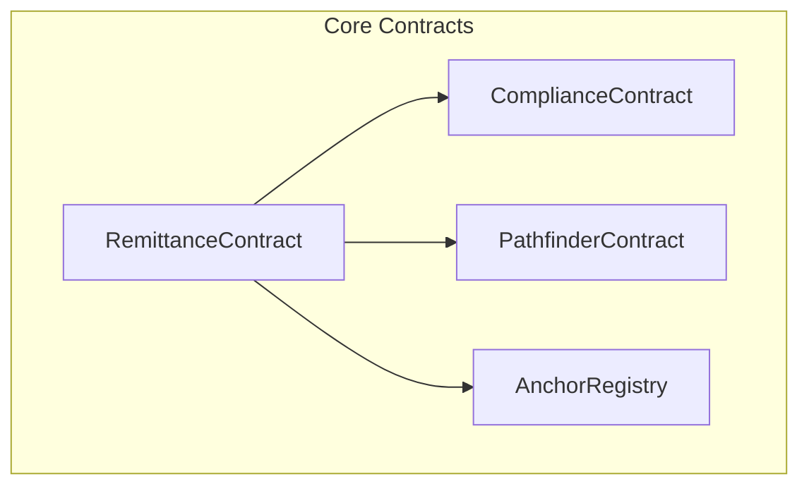

# 📚 AfriStar Pay V2 API Reference

Complete API documentation for AfriStar Pay V2 Soroban smart contracts.

---

## 🏗️ Contract Architecture



---

## 📋 Contract Addresses

### Testnet
```bash
REMITTANCE_CONTRACT = "CB64D3G7SM2RTH6JSGG34DDTFTQ5CFDKVWBXPV2AAAAAAAAAAWHXSJWL"
COMPLIANCE_CONTRACT = "CBQHNAXSI55GX2GN6D67GK7BHVPSJO5P2NK7RIGGGO7LXUN6CD3HDIKA"
```

### Mainnet
```bash
# To be updated after mainnet deployment
REMITTANCE_CONTRACT = "TBD"
COMPLIANCE_CONTRACT = "TBD"
```

---

## 🚀 RemittanceContract API

The main contract handling cross-border remittance transactions.

### **initialize**

Initialize the remittance contract with required dependencies.

```rust
pub fn initialize(
    env: Env,
    admin: Address,
    compliance_contract: Address,
    anchor_registry: Address,
    pathfinder_contract: Address,
) -> Result<(), RemittanceError>
```

**Parameters:**
- `admin`: Contract administrator address
- `compliance_contract`: Address of compliance verification contract
- `anchor_registry`: Address of anchor registry contract  
- `pathfinder_contract`: Address of pathfinder contract

**Returns:** `Result<(), RemittanceError>`

**Example:**
```bash
soroban contract invoke \
  --id CB64D3G7SM2RTH6JSGG34DDTFTQ5CFDKVWBXPV2AAAAAAAAAAWHXSJWL \
  --source deployer \
  --network testnet \
  -- initialize \
  --admin GABC123... \
  --compliance_contract CBQH... \
  --anchor_registry CANC... \
  --pathfinder_contract CPATH...
```

---

### **create_remittance**

Create a new remittance transaction with zero-knowledge compliance verification.

```rust
pub fn create_remittance(
    env: Env,
    sender: Address,
    recipient: Address,
    send_asset: Address,
    dest_asset: Address,
    send_amount: i128,
    min_dest_amount: i128,
    corridor_id: String,
    compliance_proof: Bytes,
) -> Result<RemittanceId, RemittanceError>
```

**Parameters:**
- `sender`: Sender's Stellar address (must authorize)
- `recipient`: Recipient's Stellar address
- `send_asset`: Asset contract address to send
- `dest_asset`: Asset contract address to receive  
- `send_amount`: Amount to send (scaled by asset decimals)
- `min_dest_amount`: Minimum acceptable destination amount
- `corridor_id`: Remittance corridor identifier (e.g., "USDC_NGN")
- `compliance_proof`: Zero-knowledge proof for KYC/AML compliance

**Returns:** `Result<RemittanceId, RemittanceError>`

**Errors:**
- `InvalidAmount`: Send amount must be > 0
- `InvalidAddress`: Invalid sender/recipient address
- `ComplianceCheckFailed`: ZK proof verification failed
- `PathNotFound`: No viable payment path exists
- `InsufficientBalance`: Sender lacks sufficient funds

**Events Emitted:**
```rust
("CREATE", sender) => (remittance_id, recipient, corridor_id, send_amount, dest_amount)
```

**Example:**
```bash
soroban contract invoke \
  --id CB64D3G7SM2RTH6JSGG34DDTFTQ5CFDKVWBXPV2AAAAAAAAAAWHXSJWL \
  --source GABC123... \
  --network testnet \
  -- create_remittance \
  --sender GABC123... \
  --recipient GDEF456... \
  --send_asset CUSDC123... \
  --dest_asset CNGN456... \
  --send_amount 100000000 \
  --min_dest_amount 158000000000 \
  --corridor_id "USDC_NGN" \
  --compliance_proof 0x1234abcd...
```

---

### **execute_remittance**

Execute a pending remittance transaction through the optimal payment path.

```rust
pub fn execute_remittance(
    env: Env,
    remittance_id: RemittanceId,
) -> Result<(), RemittanceError>
```

**Parameters:**
- `remittance_id`: Unique identifier of the remittance to execute

**Returns:** `Result<(), RemittanceError>`

**Errors:**
- `RemittanceNotFound`: Invalid remittance ID
- `InvalidStatus`: Only pending remittances can be executed
- `ComplianceExpired`: Compliance verification expired (>24h)
- `InternalError`: Execution failed due to network issues

**Events Emitted:**
```rust
("COMPLETE", sender) => (remittance_id, recipient, dest_amount)  // On success
("FAILED", sender) => (remittance_id, refund_amount)            // On failure
```

**Example:**
```bash
soroban contract invoke \
  --id CB64D3G7SM2RTH6JSGG34DDTFTQ5CFDKVWBXPV2AAAAAAAAAAWHXSJWL \
  --source GABC123... \
  --network testnet \
  -- execute_remittance \
  --remittance_id 0xrem_1234...
```

---

### **get_remittance**

Retrieve remittance details and status.

```rust
pub fn get_remittance(
    env: Env,
    remittance_id: RemittanceId,
) -> Result<RemittanceData, RemittanceError>
```

**Parameters:**
- `remittance_id`: Unique identifier of the remittance

**Returns:** `Result<RemittanceData, RemittanceError>`

**RemittanceData Structure:**
```rust
pub struct RemittanceData {
    pub id: RemittanceId,
    pub sender: Address,
    pub recipient: Address,
    pub send_asset: Address,
    pub dest_asset: Address,
    pub send_amount: i128,
    pub dest_amount: i128,
    pub corridor_id: String,
    pub status: RemittanceStatus,  // Pending | Completed | Failed | Cancelled
    pub created_at: u64,
    pub path: Vec<Address>,        // Asset addresses in payment path
    pub compliance_verified: bool,
}
```

**Example:**
```bash
soroban contract invoke \
  --id CB64D3G7SM2RTH6JSGG34DDTFTQ5CFDKVWBXPV2AAAAAAAAAAWHXSJWL \
  --source GABC123... \
  --network testnet \
  -- get_remittance \
  --remittance_id 0xrem_1234...
```

---

### **get_sender_remittances**

Get all remittances for a specific sender (paginated).

```rust
pub fn get_sender_remittances(
    env: Env,
    sender: Address,
    limit: Option<u32>,
) -> Vec<RemittanceData>
```

**Parameters:**
- `sender`: Sender's address to query
- `limit`: Maximum results (default: 10, max: 100)

**Returns:** `Vec<RemittanceData>` (most recent first)

**Example:**
```bash
soroban contract invoke \
  --id CB64D3G7SM2RTH6JSGG34DDTFTQ5CFDKVWBXPV2AAAAAAAAAAWHXSJWL \
  --source GABC123... \
  --network testnet \
  -- get_sender_remittances \
  --sender GABC123... \
  --limit 25
```

---

### **cancel_remittance**

Cancel a pending remittance (sender only).

```rust
pub fn cancel_remittance(
    env: Env,
    remittance_id: RemittanceId,
) -> Result<(), RemittanceError>
```

**Parameters:**
- `remittance_id`: Unique identifier of remittance to cancel

**Returns:** `Result<(), RemittanceError>`

**Authorization:** Must be called by the original sender

**Events Emitted:**
```rust
("CANCEL", sender) => (remittance_id, refund_amount)
```

**Example:**
```bash
soroban contract invoke \
  --id CB64D3G7SM2RTH6JSGG34DDTFTQ5CFDKVWBXPV2AAAAAAAAAAWHXSJWL \
  --source GABC123... \
  --network testnet \
  -- cancel_remittance \
  --remittance_id 0xrem_1234...
```

---

### **get_corridors**

Get all supported remittance corridors.

```rust
pub fn get_corridors(env: Env) -> Vec<CorridorInfo>
```

**Returns:** `Vec<CorridorInfo>`

**CorridorInfo Structure:**
```rust
pub struct CorridorInfo {
    pub id: String,               // "USDC_NGN"
    pub name: String,             // "USD to Nigerian Naira"  
    pub source_country: String,   // "US"
    pub dest_country: String,     // "NG"
    pub source_currency: String,  // "USD"
    pub dest_currency: String,    // "NGN"
    pub send_asset: Address,      // USDC contract
    pub dest_asset: Address,      // NGN token contract
    pub min_amount: i128,         // Minimum transfer amount
    pub max_amount: i128,         // Maximum transfer amount
    pub fee_rate: i128,           // Fee in basis points
    pub anchor_send: Address,     // Sending anchor
    pub anchor_receive: Address,  // Receiving anchor
    pub active: bool,             // Corridor status
}
```

**Example:**
```bash
soroban contract invoke \
  --id CB64D3G7SM2RTH6JSGG34DDTFTQ5CFDKVWBXPV2AAAAAAAAAAWHXSJWL \
  --source GABC123... \
  --network testnet \
  -- get_corridors
```

---

### **add_corridor** (Admin Only)

Add a new remittance corridor.

```rust
pub fn add_corridor(
    env: Env,
    corridor_info: CorridorInfo,
) -> Result<(), RemittanceError>
```

**Parameters:**
- `corridor_info`: Complete corridor configuration

**Authorization:** Admin only

**Events Emitted:**
```rust
("CORRIDOR",) => (corridor_id, name, source_country, dest_country)
```

---

## 🔐 ComplianceContract API

Handles zero-knowledge compliance verification for regulatory requirements.

### **initialize**

Initialize compliance contract.

```rust
pub fn initialize(env: Env, admin: Address)
```

### **verify_compliance**

Verify zero-knowledge compliance proof.

```rust
pub fn verify_compliance(
    env: Env,
    user_address: Address,
    corridor_id: String,
    zk_proof: ZkProofData,
) -> bool
```

**Parameters:**
- `user_address`: User's Stellar address
- `corridor_id`: Remittance corridor requiring compliance
- `zk_proof`: Zero-knowledge proof bundle

**ZkProofData Structure:**
```rust
pub struct ZkProofData {
    pub proof: Bytes,             // Groth16 proof data
    pub public_inputs: Vec<Bytes>, // Public inputs for verification
    pub verification_key: Bytes,   // Verification key for circuit
}
```

**Returns:** `bool` - True if compliance verified

**Privacy Guarantees:**
- ✅ KYC status verified without revealing identity
- ✅ Sanctions screening without exposing personal data
- ✅ Age verification without revealing actual age
- ✅ Residency proof without revealing address

---

### **submit_kyc_verification** (KYC Providers Only)

Submit KYC verification for a user.

```rust
pub fn submit_kyc_verification(
    env: Env,
    user_address: Address,
    kyc_level: u32,           // 0=None, 1=Basic, 2=Enhanced, 3=Premium
    risk_score: u32,          // 0-100 (lower is better)
    sanctions_clear: bool,
    verifier: Address,
    validity_period: u64,     // Seconds until expiration
)
```

**Authorization:** Authorized KYC provider only

---

### **get_compliance_status**

Get current compliance status for a user.

```rust
pub fn get_compliance_status(
    env: Env,
    user_address: Address,
) -> Option<ComplianceRecord>
```

**ComplianceRecord Structure:**
```rust
pub struct ComplianceRecord {
    pub user_address: Address,
    pub kyc_level: u32,
    pub risk_score: u32,
    pub sanctions_clear: bool,
    pub verified_at: u64,
    pub expires_at: u64,
    pub verifier: Address,
}
```

---

### **add_kyc_verifier** (Admin Only)

Add authorized KYC verification provider.

```rust
pub fn add_kyc_verifier(
    env: Env,
    verifier_address: Address,
    verifier_name: String,
)
```

---

## 📊 Data Types & Enums

### **RemittanceStatus**
```rust
pub enum RemittanceStatus {
    Pending,    // Created but not yet executed
    Completed,  // Successfully processed
    Failed,     // Execution failed, funds refunded
    Cancelled,  // Cancelled by sender, funds refunded
}
```

### **RemittanceError**
```rust
pub enum RemittanceError {
    // Initialization errors (1000-1099)
    AlreadyInitialized = 1000,
    NotInitialized = 1001,
    
    // Authentication errors (1100-1199)
    Unauthorized = 1100,
    AdminOnly = 1101,
    
    // Validation errors (1200-1299)  
    InvalidAmount = 1200,
    InvalidAddress = 1201,
    InvalidAsset = 1202,
    InvalidCorridor = 1203,
    InvalidProof = 1204,
    
    // Business logic errors (1300-1399)
    InsufficientBalance = 1300,
    AmountTooLow = 1301,
    AmountTooHigh = 1302,
    CorridorNotActive = 1303,
    PathNotFound = 1304,
    SlippageTooHigh = 1305,
    
    // Compliance errors (1400-1499)
    ComplianceCheckFailed = 1400,
    ComplianceExpired = 1401,
    KycRequired = 1402,
    SanctionsViolation = 1403,
    RiskTooHigh = 1404,
    
    // State errors (1500-1599)
    RemittanceNotFound = 1500,
    InvalidStatus = 1501,
    AlreadyProcessed = 1502,
    
    // External service errors (1600-1699)
    AnchorUnavailable = 1600,
    PathfinderError = 1601,
    ComplianceServiceError = 1602,
    
    // System errors (1700-1799)
    InternalError = 1700,
    ContractPaused = 1701,
    MaintenanceMode = 1702,
}
```

### **KycLevel**
```rust
pub enum KycLevel {
    None = 0,     // No KYC verification
    Basic = 1,    // Email + phone verification
    Enhanced = 2, // Government ID verification  
    Premium = 3,  // Full KYC with document verification
}
```

---

## 🔗 Integration Examples

### **JavaScript/TypeScript Integration**

```typescript
import { Contract, SorobanRpc, TransactionBuilder, Networks } from '@stellar/stellar-sdk'

// Initialize contract client
const server = new SorobanRpc.Server('https://soroban-testnet.stellar.org')
const contractAddress = 'CB64D3G7SM2RTH6JSGG34DDTFTQ5CFDKVWBXPV2AAAAAAAAAAWHXSJWL'

// Create remittance
async function createRemittance(
  senderKeypair: Keypair,
  recipient: string,
  sendAmount: string,
  corridorId: string
) {
  const account = await server.getAccount(senderKeypair.publicKey())
  
  const contract = new Contract(contractAddress)
  
  const transaction = new TransactionBuilder(account, {
    fee: BASE_FEE,
    networkPassphrase: Networks.TESTNET,
  })
    .addOperation(
      contract.call(
        'create_remittance',
        Address.fromString(senderKeypair.publicKey()),
        Address.fromString(recipient),
        Address.fromString('CUSDC123...'), // Send asset
        Address.fromString('CNGN456...'),  // Dest asset
        nativeToScVal(sendAmount, { type: 'i128' }),
        nativeToScVal('158000000000', { type: 'i128' }), // Min dest amount
        nativeToScVal(corridorId, { type: 'string' }),
        nativeToScVal(Buffer.from('compliance_proof'), { type: 'bytes' })
      )
    )
    .setTimeout(180)
    .build()

  transaction.sign(senderKeypair)
  
  const result = await server.sendTransaction(transaction)
  return result
}

// Get remittance status
async function getRemittanceStatus(remittanceId: string) {
  const contract = new Contract(contractAddress)
  
  const result = await server.simulateTransaction(
    new TransactionBuilder(await server.getAccount('GABC123...'), {
      fee: BASE_FEE,
      networkPassphrase: Networks.TESTNET,
    })
      .addOperation(
        contract.call(
          'get_remittance',
          nativeToScVal(Buffer.from(remittanceId, 'hex'), { type: 'bytes' })
        )
      )
      .setTimeout(180)
      .build()
  )
  
  return scValToNative(result.result?.retval)
}
```

### **React Hook Integration**

```typescript
import { useStellar } from '@/contexts/StellarContext'
import { useQuery, useMutation } from '@tanstack/react-query'

export function useCreateRemittance() {
  const { createRemittance } = useStellar()
  
  return useMutation({
    mutationFn: createRemittance,
    onSuccess: (result) => {
      toast.success('Remittance created successfully!')
    },
    onError: (error) => {
      toast.error(`Failed to create remittance: ${error.message}`)
    }
  })
}

export function useRemittanceStatus(remittanceId: string) {
  const { getRemittanceStatus } = useStellar()
  
  return useQuery({
    queryKey: ['remittance', remittanceId],
    queryFn: () => getRemittanceStatus(remittanceId),
    enabled: !!remittanceId,
    refetchInterval: 5000, // Poll every 5 seconds
  })
}

export function useUserRemittances(publicKey: string) {
  const { getUserRemittances } = useStellar()
  
  return useQuery({
    queryKey: ['userRemittances', publicKey],
    queryFn: () => getUserRemittances(publicKey),
    enabled: !!publicKey,
  })
}
```

---

## 🔍 Event Monitoring

### **Contract Events**

All contract events follow this pattern:
```rust
env.events().publish((topic, indexed_data), data_tuple)
```

### **Event Types**

| Event Type | Topics | Data | Description |
|------------|---------|------|-------------|
| `INIT` | `()` | `(admin_address)` | Contract initialized |
| `CREATE` | `(sender)` | `(remittance_id, recipient, corridor_id, send_amount, dest_amount)` | Remittance created |
| `COMPLETE` | `(sender)` | `(remittance_id, recipient, dest_amount)` | Remittance completed |
| `FAILED` | `(sender)` | `(remittance_id, refund_amount)` | Remittance failed |
| `CANCEL` | `(sender)` | `(remittance_id, refund_amount)` | Remittance cancelled |
| `CORRIDOR` | `()` | `(corridor_id, name, source_country, dest_country)` | Corridor added |
| `KYC_OK` | `(user)` | `(recipient, corridor_id)` | Compliance verified |
| `KYC_FAIL` | `(user)` | `(reason)` | Compliance failed |

### **Event Subscription**

```bash
# Monitor all events
soroban events --start-ledger recent --contract-id CB64D3G7SM2RTH6JSGG34DDTFTQ5CFDKVWBXPV2AAAAAAAAAAWHXSJWL

# Filter by event type  
soroban events --start-ledger recent --contract-id CB64D3G7SM2RTH6JSGG34DDTFTQ5CFDKVWBXPV2AAAAAAAAAAWHXSJWL --topic CREATE

# Monitor specific user events
soroban events --start-ledger recent --contract-id CB64D3G7SM2RTH6JSGG34DDTFTQ5CFDKVWBXPV2AAAAAAAAAAWHXSJWL --topic GABC123...
```

---

## 📈 Rate Limits & Quotas

### **Per-User Limits**
- **Transaction Frequency**: 10 remittances per minute
- **Daily Volume**: 50,000 USDC equivalent per 24h period
- **Single Transaction**: 10,000 USDC maximum per transaction

### **Global Limits**  
- **Contract TPS**: 100 transactions per second
- **Daily Volume**: 10M USDC equivalent per 24h period
- **Concurrent Users**: 10,000 active users

### **Compliance Requirements**
- **KYC Levels**: Enhanced (level 2) required for >1000 USDC
- **Risk Scoring**: Maximum risk score of 25/100
- **Sanctions**: Real-time OFAC sanctions screening
- **Jurisdiction**: Compliance varies by corridor

---

## 🛡️ Security Considerations

### **Input Validation**
- All addresses validated using `StrKey` validation
- Amounts checked for overflow and underflow
- String inputs sanitized and length-limited
- Asset contracts verified as valid tokens

### **Access Controls**
- Admin functions restricted to authorized addresses
- User authorization required for all state changes
- KYC provider authorization for compliance functions
- Emergency pause mechanism for security incidents

### **Reentrancy Protection**
- External calls made after state updates
- Use of checks-effects-interactions pattern
- Atomic operations with proper rollback on failure

---

## 📞 Support & Resources

- **API Issues**: [GitHub Issues](https://github.com/yourusername/afristar-pay-v2/issues)
- **Integration Help**: [Discord Community](https://discord.gg/afristarpay)
- **Security Reports**: security@afristarpay.com
- **General Questions**: support@afristarpay.com

---

**Last Updated**: 2026-07-05  
**API Version**: 2.0.0  
**Contract Version**: 1.0.0